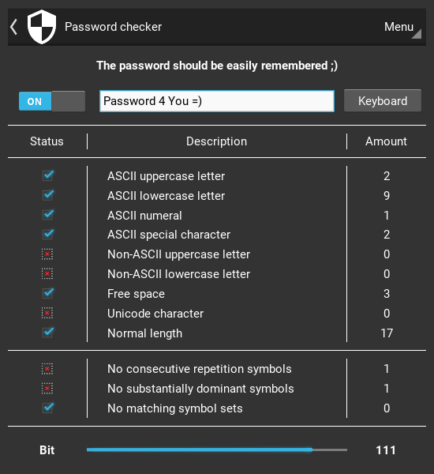

# Password checker
Password check for compliance with minimum security requirements

## Requirements
- Python >= 3.6
- Kivy >= 1.10
- [Widgets KV](https://github.com/Paduct/widgets_kv)

## Installation
```shell
git clone https://github.com/Paduct/password_checker
```

## Usage
### with GUI
```shell
python password_checker
```
### from TUI
```shell
python password_checker/src/checker.py
```
```
usage: checker.py [-h] [-c] [-e] [-s]

optional arguments:
  -h, --help  show this help message and exit
  -c          turn color design
  -e          ASCII85 encode
  -s          show password
```

## Screenshot

